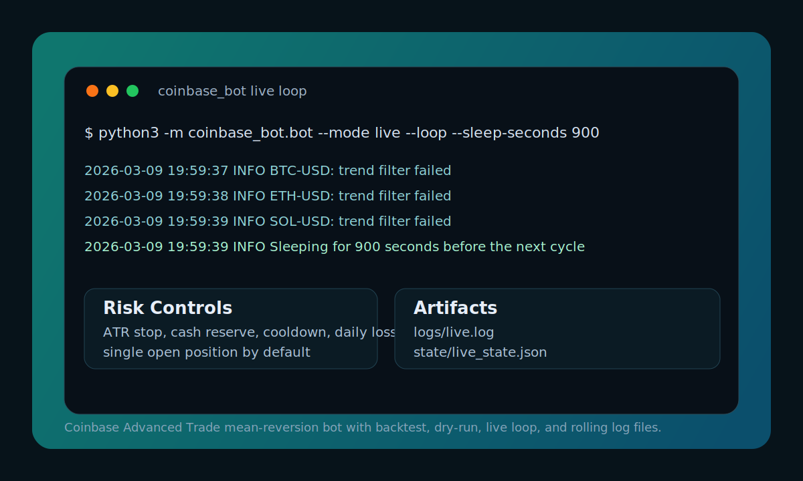

# Coinbase Mean-Reversion Bot



Coinbase Advanced Trade bot with a conservative spot mean-reversion core and an optional low-allocation perp sidecar for BTC and ETH.

## What It Does

- Trades Coinbase spot pairs such as `BTC-USD`, `ETH-USD`, and `SOL-USD`
- Can optionally monitor `BTC-PERP-INTX` and `ETH-PERP-INTX` with separate low-leverage pullback logic
- Uses a long-only mean-reversion setup:
  - price stretched below lower Bollinger Band
  - oversold RSI
  - `EMA50 > EMA200`
  - rising slow trend
  - ATR and volume filters
- Manages risk with:
  - ATR stop loss
  - take profit near the Bollinger midline
  - cash reserve
  - one open position by default
  - cooldown after trades
  - daily realized loss cap
- Supports:
  - backtests on Coinbase public candles
  - `dry-run` loops
  - `live` loops
  - rolling log files
  - a separate perp runner that stays isolated from spot state

## Quick Start

```bash
python3 -m venv .venv
source .venv/bin/activate
pip install -r requirements.txt
cp .env.example .env
```

Fill in `.env` with your Coinbase Advanced Trade API key and EC private key.

Start with a dry run:

```bash
python3 -m coinbase_bot.bot --mode dry-run --loop --sleep-seconds 900
```

Once the strategy behavior looks correct:

```bash
python3 -m coinbase_bot.bot --mode live --loop --sleep-seconds 900
```

Optional perp dry run:

```bash
python3 -m coinbase_bot.perp_bot --mode dry-run --loop --sleep-seconds 900
```

## Example Output

```text
2026-03-09 19:59:37 INFO Logging to logs/live.log
2026-03-09 19:59:37 INFO BTC-USD: trend filter failed
2026-03-09 19:59:38 INFO ETH-USD: trend filter failed
2026-03-09 19:59:39 INFO SOL-USD: trend filter failed
2026-03-09 19:59:39 INFO Sleeping for 900 seconds before the next cycle
```

## Logs And State

The bot now writes logs to rotating files automatically:

- `logs/dry-run.log`
- `logs/live.log`
- `logs/perp_dry-run.log`
- `logs/perp_live.log`

Useful commands:

```bash
tail -f logs/live.log
tail -f logs/dry-run.log
cat state/live_state.json
cat state/dry_run_state.json
cat state/perp_live_state.json
```

## Deploy To A Mac Mini

If you keep a Mac mini online 24/7, this repo includes deployment helpers for a remote Tailscale host.

Expected remote setup:

- SSH access to the mini
- a conda environment named `quant`
- `.env` already present in this repo before deployment

From your local machine:

```bash
cd "/Users/hanks/Documents/coinbase-mean-reversion-bot"
chmod +x scripts/deploy_to_mac_mini.sh scripts/remote_bootstrap_mac_mini.sh
SSH_IDENTITY_FILE="$HOME/.ssh/id_ed25519" \
REMOTE_HOST="mac@100.86.132.84" \
ENV_NAME="quant" \
./scripts/deploy_to_mac_mini.sh
```

What the deploy script does:

- copies the bot repo to the remote Mac mini
- reuses your existing `.env`
- installs Python requirements inside the `quant` environment
- creates a `launchd` agent for auto-start
- starts or restarts the live bot service

The generated `launchd` logs will land in:

```text
logs/launchd.out.log
logs/launchd.err.log
```

If `IMESSAGE_TARGET` is set in `.env`, the deploy script also installs a second `launchd` job that sends periodic iMessage status reports with:

- BTC-USD and ETH-USD spot prices
- available balances
- open positions
- latest scan reasons
- recent fills

## Configure

Create `.env` from the template:

```bash
cp .env.example .env
```

Important values:

- `COINBASE_API_KEY`
- `COINBASE_API_SECRET`
- `BOT_PRODUCTS`
- `BOT_PER_TRADE_QUOTE_FRACTION`
- `BOT_MIN_CASH_RESERVE`
- `BOT_MAX_DAILY_LOSS_QUOTE`
- `COINBASE_ALLOW_LIVE_TRADING`
- `PERP_BOT_ENABLED`
- `COINBASE_ALLOW_PERP_LIVE_TRADING`
- `COINBASE_PERP_PORTFOLIO_UUID`

Live trading stays disabled until:

```env
COINBASE_ALLOW_LIVE_TRADING="true"
```

Perp trading stays disabled until:

```env
PERP_BOT_ENABLED="true"
COINBASE_ALLOW_PERP_LIVE_TRADING="true"
```

The perp runner also requires a perpetuals portfolio that the API can access. If the account is not fully enabled yet, the bot will log the permission error and skip entries safely.

## Backtest

Run a quick sanity check on Coinbase public candles:

```bash
python3 -m coinbase_bot.backtest --product BTC-USD --candles 500
```

Or with your own CSV:

```bash
python3 -m coinbase_bot.backtest --product BTC-USD --csv /path/to/candles.csv
```

The backtest is intentionally simple. It is useful for regression checks, not as proof of future live performance.

## Run Modes

Single dry run:

```bash
python3 -m coinbase_bot.bot --mode dry-run
```

Continuous dry run:

```bash
python3 -m coinbase_bot.bot --mode dry-run --loop --sleep-seconds 900
```

Single live scan:

```bash
python3 -m coinbase_bot.bot --mode live
```

Continuous live loop:

```bash
python3 -m coinbase_bot.bot --mode live --loop --sleep-seconds 900
```

Continuous perp loop:

```bash
python3 -m coinbase_bot.perp_bot --mode dry-run --loop --sleep-seconds 900
```

## Repository Layout

```text
coinbase_bot/
  backtest.py
  bot.py
  config.py
  exchange.py
  indicators.py
  perp_bot.py
  perp_strategy.py
  state.py
  strategy.py
assets/
  readme-preview.svg
tests/
  test_perp_strategy.py
  test_strategy.py
Reversal2.0.ipynb
update_reversal_csv.ipynb
```

## Tests

```bash
python3 -m unittest discover -s tests
```

## Security Notes

- Never commit `.env`
- Rotate any key that was ever pasted into chat, shell history, or screenshots
- Start with `dry-run` before `live`
- Trade one product first before expanding the list

## Research Notes

This repo still includes the original reversal notebooks:

- `update_reversal_csv.ipynb`
- `Reversal2.0.ipynb`

They are useful for research but are separate from the execution bot.
